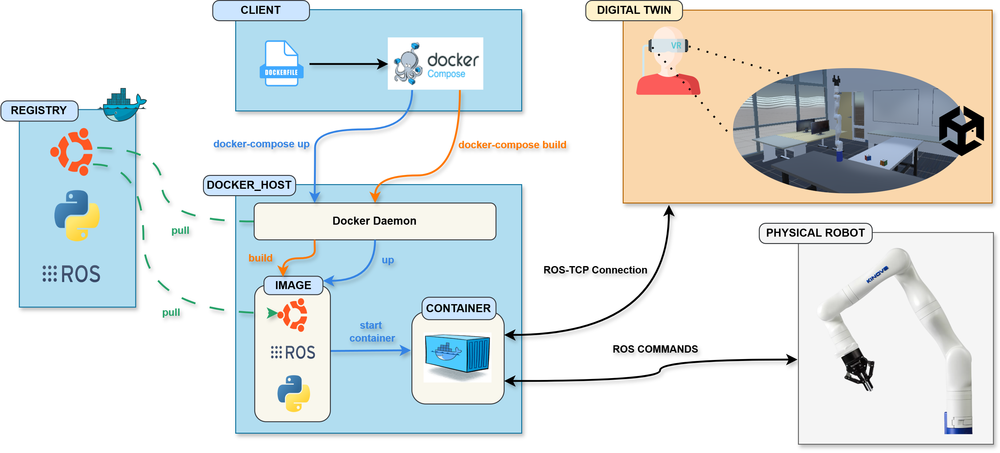
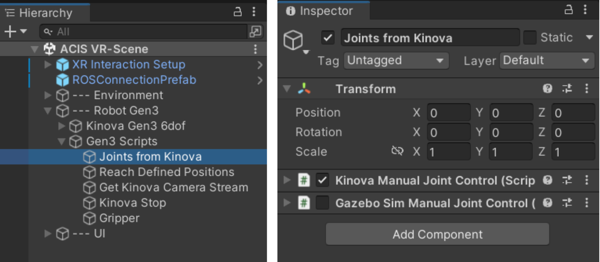

# ROS-Docker Framework for Digital Twin Applications
[Yehor Karpichev](https://scholar.google.com/citations?user=eDsR_O0AAAAJ&hl=en), [Mahmoud Chick Zaouali](https://scholar.google.com/citations?hl=en&user=nYQwIk4AAAAJ), [Todd Charter](https://scholar.google.com/citations?user=7qJcX5IAAAAJ&hl=en), [Homayoun Najjaran](https://scholar.google.com/citations?hl=en&user=HQ7bYVkAAAAJ)

<!--
This repository contains the official implementation associated with the paper [**"A Deployable and Scalable ROS-Docker Framework for Multi-Platform Digital Twin Applications"**](https://arxiv.org/) (Submitted to IEEE conference). 
-->


## Overview 

This project tackles the challenges of managing and integrating complex cyber-physical systems in robotics, especially in environments with diverse hardware and software dependencies. It introduces a multi-platform framework that combines ROS and Docker, enabling scalable, reproducible software pipelines for robotics applications. The project leverages digital twin technology to simulate and control robots, with a collaborative robot serving as a case study.

The image below presents the full communications pipeline. On the client side, the Dockerfile specifies how to build the image, while Docker Compose is used to send commands to the Docker daemon to execute the build. If necessary, base layers such as Ubuntu and ROS are pulled From Docker Hub/Registry. Running ``docker-compose up`` directs the Docker Daemon to create and start the container from the built image. The container then launches ROS nodes to enable communication between the Digital Twin, ROS and the physical robot.

<p align="center">
  
</p>

Similarly, we show the general overview of the running ROS network in the container [here](https://github.com/ykarpi/Gen3-Immersive-Control/blob/main/media/ROS-Docker/ROS-Connections.png).

On the Digital Twin side, we developed a virtual replica of the Advanced Control and Inteligent Systems (ACIS) lab at the University of Victoria with the model of Kinova Gen3 as the case study. A simple UI and VR-based interactions are implemented to create an immersive user experience. The current implementation allows users to send the robot to predefined positions, activate the emergency stop, clear faults, control the gripper, and access the camera feed from the robot's onboard camera. Additionally, users can enable manual control, which disconnects the robot from the physical system, allowing them to preview joint-based control positions before sending the commands to the physical robot.

## Video 
(coming soon)
<p  align="center">
    <a href="https://www.youtube.com/" target="_blank">
        
    </a>
</p>


## Installation
Please use the main branch when cloning the repository, as other branches are currently under development. The pipeline has been fully developed and tested on a **Windows 10 machine**. Furthermore, we provide setup instructions with utilizing [Gazebo](#gazebo-simulation) for when the physical arm is not accessible.

**Setup technologies:**
Since we utilize Docker for creating a containarized environment, the project requires an installation only of Docker and Unity game engine. For running RViz on Windows machine, also an X server is needed, and we explain it in the [Display forwarding](#display-forwarding) section.
- [Docker](https://www.docker.com/products/docker-desktop/)
- [Unity](https://unity.com/products/unity-engine)

The digital twin environment is Unity is developed for VR, and it's tested with Meta Quest 2. Some settings might need to be adjusted for other headsets. You can also preview the demo just from the Unity game window. 

### Unity setup
The implementation includes a virtual replica of the research lab with a the Kinova Gen3 6DOF robot model. When utilizing the repository, the project should be complete and ready to go. We recommend using the same Unity version (2021.3.45f), but it should work with other versions as well. However, if you choose to use v2022 or above, keep in mind some of the known issues with the URDF importer, like [this](https://discussions.unity.com/t/difficulties-loading-custom-urdf-file-with-urdf-importer/929569).

### Docker environment:
We provide `docker-compose` and `Dockerfile`, therefore, make sure to navigate to the docker folder in the cloned repository, and follow the steps below.

Firstly, build an image that includes all required packages: 
```shell
docker-compose build
```

When the image is built we can launch a container (or multiple containers if required)

Launch a docker container with the `docker-compose up` command (prefered):
```shell
docker-compose up
```

Alternatively: after building an image, instead of the `docker-compose up` the following command can be used:
```shell
docker run -it -p 10000:10000 IMAGE_NAME /bin/bash
```

## Launch commands:
After you've statrted your container, multiple launch commands must be run to a) start the robot driver & the vision module, b) run the unity endpoint, and c) run the scripts for starting a custom ros node for the data flow from the DT environment.

Assuming you are in the ~/catkin_workspace envrionment: 

**Kinova Driver:**
```shell
roslaunch kortex_driver kortex_driver.launch ip_address:=192.168.0.10 dof:=6 gripper:=robotiq_2f_85
```
Modify `ip address`, `dof`, `gripper`, and other arguments to suit a specific model. More details are available in the Kinova [ros_kortex](https://github.com/Kinovarobotics/ros_kortex/tree/noetic-devel/kortex_driver) repo.


**Kinova Vision:** 
```shell
roslaunch kinova_vision kinova_vision_rgbd.launch device:=192.168.0.10
```
Our robot has a vision module, and a separate driver from Kinova must be launched to access it. Modify the IP and other parameters as described in the official documentation [here](https://github.com/Kinovarobotics/ros_kortex_vision).

**Unity Endpoint:**
```shell
roslaunch ros_tcp_endpoint endpoint.launch
```
You can add parameters like tcp_ip and tcp_port to specify which you wish to use. The default is `tcp_ip=0.0.0.0`, and `tcp_port=10000`. Alternatively, you may edit the endpoint.launch file directly. If port is modified, ensure that a new port is mapped when launching the Docker container. 

Official github page by Unity-Technologies: [unity-endpoint](https://github.com/Unity-Technologies/ROS-TCP-Endpoint).


**Our Python scipt:**
```shell
python src/python_scripts/robot_control.py __ns:=my_gen3
```
We've developed a couple custom python scripts that launch a separate ros node & topics for passing the data from the developed Digital Twin to the MoveIt interface for controlling the physical system. Replace `my_gen3` in `__ns:=my_gen3` with a proper name, if you are using a different robot/model.


## Display Forwarding

Display forwarding is needed in order to run the Linux-native applications on the windows host machine. For example, we run and control the robot from RViz. The config line regarding the display forwarding is added as part of the docker-compose to ensure that applications like RViz and Gazebo will run smoothly. 

However, if facing any issues, the following command can be executed directly from the container environment as well: 
```shell
export DISPLAY=host.docker.internal:0
```

Note that in order to make sure that RViz launches and works properly, the installation of an X server is required. In our implementation we used the free distributions of the [VcXsrv Windows X Server](https://sourceforge.net/projects/vcxsrv/)

Upon installaton, open the application, and you may experiment with different setups, however, we recommend the settings indicated in [X Server setup](https://github.com/ykarpi/Gen3-Immersive-Control/tree/main/media/X%20server%20setup).


## Docker commands
We list some of the basic Docker command below as these might come in handy when working with Docker images/containers. All commands are executed from the windows terminal.

(i) To check all exiting containers:
```shell
docker ps -a
```

(ii) To start a stopped container using its ID:
```shell
docker start CONTAINER_ID
```

(iii) To launch an interactive bash shell inside a running container: 
```shell
docker exec -it CONTAINER_ID /bin/bash
```

(iv) To stop a running container using its ID:
```shell
docker stop CONTAINER_ID
```

(v) Delete a container:
```shell
docker rm CONTAINER_ID
```

(vi) Check existing images: 
```shell
docker images
```

(vii) Delete an image:
```shell
docker rmi IMAGE_ID
```

## Gazebo Simulation

If the physical robot model is not present, the project can be executed with a simulated arm in Gazebo.

<div align="center" style="display: flex; justify-content: center; gap: 100px;">
  
  
</div>


<!--
<p align="center">
  
</p>

<p align="center">
  
</p>
-->

### Launch commands with simulated arm

Assuming you've started the docker container, and currently in `~/catkin_environment`, the following commands should be executed:

**Gazebo Kinova Driver:**
```shell
roslaunch kortex_gazebo spawn_kortex_robot.launch arm:=gen3 dof:=6 gripper:=robotiq_2f_85
```
More info on the gazebo implementation and kortex control at the Kinova's official [github](https://github.com/Kinovarobotics/ros_kortex/tree/noetic-devel/kortex_gazebo). Unfortunately, there is no possibility to simulate the vision module without the physical model.

**Unity Endpoint:**
```shell
roslaunch ros_tcp_endpoint endpoint.launch
```

**Python scipt:**
```shell
python src/python_scripts/robot_control.py __ns:=my_gen3
```

#### Unity settings for simulated arm
The topic `/joint_states` publishes data in a slightly different format, therefore, Unity scripts were adjusted to take this into account. In the project's hierarchy, under the `Robot Gen3 --> Gen3 Scripts --> Joints from Kinova` gameobject, only one of the scripts should be active: either `KinovaManualJointControl` (for working with the physical system) OR `GazeboSimManualJointControl` (if you run the project with a simulated arm).


<p align="center">
  
</p>


## TODO list:
- [x] Manual joint-based control in Unity
- [x] Add support for Gazebo-based simulation
- [ ] Update docker-compose with entrypoints (and hence replace multiple launch commands)
- [ ] Docker multicontainer distribution (run kortex_vision from a separate container)
- [ ] Implement Cartesian-based control for Gen3 in Unity
- [ ] Add ROS2 implementation

